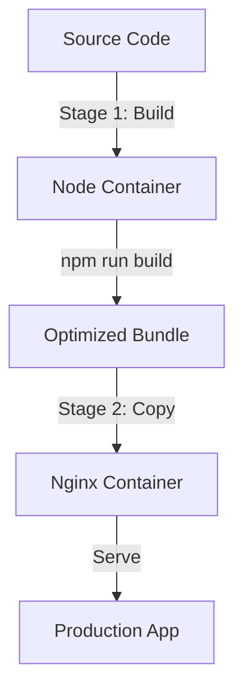

# Vue 3 + Vite + Docker Project Architecture Plan

## Project Overview

This plan outlines the architecture for a modern Vue 3 application using Vite as the build tool, with comprehensive Docker support for both development and production environments.

## Technology Stack

- **Frontend Framework**: Vue 3 (Composition API)
- **Build Tool**: Vite (fast HMR, optimized builds)
- **Development Server**: Vite dev server (with hot reload)
- **Production Server**: Nginx (lightweight, efficient)
- **Container Platform**: Docker & Docker Compose

## Project Structure

```
vue-docker-project/
├── src/                      # Vue application source code
│   ├── assets/              # Static assets (images, styles)
│   ├── components/          # Vue components
│   ├── App.vue              # Root component
│   └── main.js              # Application entry point
├── public/                   # Public static files
├── docker/                   # Docker configuration files
│   ├── nginx/
│   │   └── nginx.conf       # Nginx configuration for production
│   ├── Dockerfile.dev       # Development Dockerfile
│   └── Dockerfile           # Production Dockerfile
├── docker-compose.yml        # Docker Compose orchestration
├── .dockerignore            # Docker build exclusions
├── .env.example             # Environment variables template
├── package.json             # Node dependencies and scripts
├── vite.config.js           # Vite configuration
└── README.md                # Setup and usage documentation
```

## Docker Architecture

### Development Environment

**Purpose**: Enable fast development with hot module replacement (HMR)

**Key Features**:
- Volume mounting for real-time code synchronization
- Vite dev server with HMR enabled
- Port 5173 exposed for browser access
- Node modules cached in container for performance

**Workflow**:


**Container Specifications**:
- Base Image: `node:18-alpine` (lightweight)
- Working Directory: `/app`
- Exposed Port: `5173`
- Command: `npm run dev -- --host`

### Production Environment

**Purpose**: Serve optimized, production-ready application

**Multi-Stage Build Process**:

1. **Build Stage**:
   - Use Node.js to build optimized Vue bundle
   - Run `npm run build` to generate static files
   - Output to `/app/dist`

2. **Serve Stage**:
   - Use Nginx alpine image (minimal size)
   - Copy built files from build stage
   - Configure Nginx for SPA routing
   - Expose port 80

**Workflow**:


**Container Specifications**:
- Build Image: `node:18-alpine`
- Runtime Image: `nginx:alpine`
- Exposed Port: `80`
- Size: ~25MB (nginx) vs ~1GB (full node)

## Docker Compose Configuration

### Services

1. **dev** service:
   - Uses `Dockerfile.dev`
   - Mounts source code as volume
   - Enables hot reload
   - Port: `5173:5173`

2. **prod** service:
   - Uses production `Dockerfile`
   - Multi-stage build
   - Optimized for size and performance
   - Port: `80:80`

### Usage Commands

```bash
# Development
docker-compose up dev

# Production
docker-compose up prod --build

# Stop services
docker-compose down
```

## Key Architectural Decisions

### 1. Vite over Vue CLI
**Rationale**: 
- Faster development server startup
- Instant HMR
- Better build performance
- Modern ESM-based approach
- Smaller bundle sizes

### 2. Multi-Stage Docker Builds
**Rationale**:
- Separates build and runtime dependencies
- Reduces final image size by ~97%
- Improves security (no build tools in production)
- Faster deployment and scaling

### 3. Nginx for Production
**Rationale**:
- Lightweight and efficient
- Industry standard for serving static files
- Low memory footprint
- Built-in SPA routing support
- Excellent performance

### 4. Volume Mounting for Development
**Rationale**:
- Real-time code synchronization
- No need to rebuild container on changes
- Fast feedback loop
- Maintains node_modules in container for consistency

### 5. Alpine Linux Base Images
**Rationale**:
- Minimal size (~5MB base)
- Security benefits (smaller attack surface)
- Faster downloads and deployments
- Industry best practice

## Configuration Details

### Vite Configuration
```javascript
// vite.config.js
export default {
  server: {
    host: '0.0.0.0',  // Allow external access
    port: 5173,
    watch: {
      usePolling: true  // Required for Docker on some systems
    }
  }
}
```

### Nginx Configuration
```nginx
server {
  listen 80;
  root /usr/share/nginx/html;
  index index.html;
  
  # SPA routing - all routes serve index.html
  location / {
    try_files $uri $uri/ /index.html;
  }
}
```

### Docker Ignore Patterns
```
node_modules
dist
.git
*.md
.env
```

## Performance Considerations

### Development
- **Hot Reload Speed**: Vite's HMR typically updates in <100ms
- **Initial Startup**: ~2-3 seconds for container
- **Memory Usage**: ~200-300MB per container

### Production
- **Build Time**: ~30-60 seconds (varies by project size)
- **Image Size**: ~25-30MB (with nginx alpine)
- **Runtime Memory**: ~10-20MB per container
- **Startup Time**: <1 second

## Security Best Practices

1. **Non-root User**: Nginx runs as nginx user
2. **Minimal Base Images**: Alpine reduces attack surface
3. **No Build Tools in Production**: Multi-stage builds exclude development dependencies
4. **Environment Variables**: Sensitive data in .env files (not committed)
5. **Updated Dependencies**: Regular updates for security patches

## Scalability Considerations

The architecture supports:
- **Horizontal Scaling**: Multiple containers behind load balancer
- **Container Orchestration**: Compatible with Kubernetes
- **CI/CD Integration**: Docker builds integrate easily
- **Cloud Deployment**: Works with AWS, GCP, Azure

## Development Workflow

1. Start development container: `docker-compose up dev`
2. Access application at `http://localhost:5173`
3. Edit code - changes auto-reload in browser
4. Test production build: `docker-compose up prod --build`
5. Access production build at `http://localhost`

## Next Steps

After reviewing this plan, the implementation will involve:

1. Setting up the Vue 3 project structure
2. Creating Docker configuration files
3. Setting up Docker Compose orchestration
4. Configuring Vite for Docker compatibility
5. Creating comprehensive documentation

## Questions to Consider

Before implementation, please confirm:
- Are there any specific Vue 3 features or packages you want included?
- Do you need any additional services (database, API, etc.)?
- Any specific deployment target (AWS, GCP, Azure, etc.)?
- Do you want TypeScript support (can be added easily)?
- Any specific UI framework (Vuetify, Element Plus, etc.)?