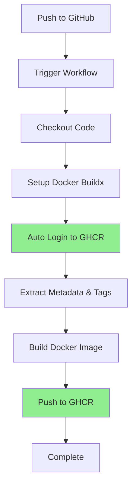

# GitHub Container Registry (GHCR) Migration Plan

## Overview

This document outlines the complete migration from Docker Hub to GitHub Container Registry (GHCR) for the ABDUL project.

**Migration Type**: Complete replacement (removing all Docker Hub references)  
**Image Visibility**: Private  
**Target Registry**: `ghcr.io`

---

## Why Migrate to GHCR?

### Benefits

✅ **Native GitHub Integration**
- No external credentials needed (uses `GITHUB_TOKEN`)
- Automatic authentication in GitHub Actions
- Seamless integration with repository permissions

✅ **Cost Effective**
- Free for public repositories
- Generous free tier for private repositories
- No rate limiting issues like Docker Hub

✅ **Security**
- Fine-grained access control via GitHub permissions
- Automatic vulnerability scanning (if enabled)
- No need to manage separate credentials

✅ **Better CI/CD Integration**
- Faster builds (same infrastructure)
- Automatic cleanup of old images
- Native support for GitHub features

---

## What Will Change

### 1. Registry URL
```diff
- REGISTRY: docker.io
+ REGISTRY: ghcr.io
```

### 2. Image Naming
```diff
- docker.io/USERNAME/dashboard:tag
+ ghcr.io/OWNER/dashboard:tag
```

### 3. Authentication
```diff
- Uses: DOCKER_USERNAME and DOCKER_PASSWORD secrets
+ Uses: Built-in GITHUB_TOKEN (automatic)
```

### 4. Login Action
```diff
- docker/login-action with Docker Hub credentials
+ docker/login-action with GitHub registry
```

---

## Files to be Modified

### 1. `.github/workflows/docker-build-push.yml`
**Changes:**
- Update `REGISTRY` environment variable
- Change `IMAGE_NAME` to repository name
- Replace Docker Hub login with GHCR login
- Update metadata action image reference
- Remove references to `DOCKER_USERNAME` and `DOCKER_PASSWORD`

### 2. `.github/DEPLOYMENT_GUIDE.md`
**Changes:**
- Replace Docker Hub setup instructions with GHCR
- Update authentication section
- Change all image pull/push examples
- Update troubleshooting section
- Add GHCR-specific features

### 3. `dashboard/README.md`
**Changes:**
- Update deployment section
- Replace Docker Hub examples with GHCR
- Update image naming conventions

---

## Detailed Migration Steps

### Step 1: Update GitHub Actions Workflow

**File**: `.github/workflows/docker-build-push.yml`

**Changes Required:**

1. **Environment Variables**
```yaml
env:
  REGISTRY: ghcr.io
  IMAGE_NAME: ${{ github.repository }}
```

2. **Login Section**
```yaml
- name: Log in to GitHub Container Registry
  if: github.event_name != 'pull_request'
  uses: docker/login-action@v3
  with:
    registry: ghcr.io
    username: ${{ github.actor }}
    password: ${{ secrets.GITHUB_TOKEN }}
```

3. **Metadata Action**
```yaml
- name: Extract metadata
  id: meta
  uses: docker/metadata-action@v5
  with:
    images: ${{ env.REGISTRY }}/${{ env.IMAGE_NAME }}
    tags: |
      type=ref,event=branch
      type=semver,pattern={{version}}
      type=semver,pattern={{major}}.{{minor}}
      type=sha,prefix={{branch}}-
      type=raw,value=latest,enable={{is_default_branch}}
```

### Step 2: Update Documentation

**File**: `.github/DEPLOYMENT_GUIDE.md`

**Sections to Update:**
- Title and overview
- Remove Docker Hub account creation
- Add GHCR authentication instructions
- Update image pull/push examples
- Add GHCR visibility settings
- Update troubleshooting guide

**File**: `dashboard/README.md`

**Sections to Update:**
- Deployment section
- Replace Docker Hub commands with GHCR
- Update image references

### Step 3: Remove Docker Hub Secrets

**GitHub Repository Settings:**
1. Go to Settings → Secrets and variables → Actions
2. Delete `DOCKER_USERNAME` secret (if exists)
3. Delete `DOCKER_PASSWORD` secret (if exists)

**Note**: `GITHUB_TOKEN` is automatically available, no setup needed.

---

## New Image Naming Convention

### Format
```
ghcr.io/OWNER/dashboard:TAG
```

### Examples
```bash
# Latest from main branch
ghcr.io/your-username/abdul/dashboard:latest

# Main branch
ghcr.io/your-username/abdul/dashboard:main

# Feature branch
ghcr.io/your-username/abdul/dashboard:feature-new-ui

# Specific commit
ghcr.io/your-username/abdul/dashboard:main-abc123

# Semantic version (if tagged)
ghcr.io/your-username/abdul/dashboard:v1.0.0
ghcr.io/your-username/abdul/dashboard:1.0
```

**Note**: Replace `your-username` with actual GitHub username/org.

---

## Authentication Guide

### For CI/CD (Automatic)
GitHub Actions automatically provides `GITHUB_TOKEN` with package write permissions.

### For Local Development
```bash
# Login to GHCR
echo $GITHUB_TOKEN | docker login ghcr.io -u USERNAME --password-stdin

# Or create a Personal Access Token (PAT)
# 1. GitHub → Settings → Developer settings → Personal access tokens
# 2. Generate new token (classic)
# 3. Select scopes: write:packages, read:packages, delete:packages
# 4. Login with PAT
echo $PAT | docker login ghcr.io -u USERNAME --password-stdin
```

### Pull Images (Public)
```bash
# No authentication needed for public images
docker pull ghcr.io/owner/dashboard:latest
```

### Pull Images (Private)
```bash
# Must be authenticated
docker login ghcr.io
docker pull ghcr.io/owner/dashboard:latest
```

---

## Image Visibility Settings

### Making Images Public/Private

**Via GitHub Web UI:**
1. Go to repository main page
2. Click "Packages" on right sidebar
3. Click on package name
4. Go to "Package settings"
5. Scroll to "Danger Zone"
6. Change visibility

**Via Workflow (Automatic)**
Images inherit repository visibility by default, but can be set explicitly:

```yaml
metadata:
  org.opencontainers.image.visible: "true"  # or "false"
```

---

## Comparison: Docker Hub vs GHCR

| Feature | Docker Hub | GHCR |
|---------|-----------|------|
| **Authentication** | Separate credentials | GitHub token |
| **Rate Limits** | 100-200 pulls/6h | Generous limits |
| **CI/CD Integration** | Requires secrets | Native |
| **Cost** | Limited free tier | Free for public |
| **Visibility Control** | Repository settings | GitHub permissions |
| **Security Scanning** | Paid feature | Available |
| **Multi-arch Support** | ✅ | ✅ |

---

## CI/CD Pipeline Flow (New)



---

## Testing the Migration

### Verification Steps

1. **Check Workflow Runs**
   - Go to Actions tab
   - Verify workflow completes successfully
   - Check for any authentication errors

2. **Verify Image in GHCR**
   - Go to repository → Packages
   - Click on dashboard package
   - Verify tags are correct

3. **Test Image Pull**
   ```bash
   docker pull ghcr.io/OWNER/dashboard:latest
   docker run -p 80:80 ghcr.io/OWNER/dashboard:latest
   ```

4. **Verify Metadata**
   ```bash
   docker inspect ghcr.io/OWNER/dashboard:latest
   ```

---

## Rollback Plan

If migration fails, rollback steps:

1. Restore `.github/workflows/docker-build-push.yml` from git history
2. Restore `.github/DEPLOYMENT_GUIDE.md` from git history
3. Re-add Docker Hub secrets if needed
4. Push changes to trigger workflow

Git commands:
```bash
git checkout HEAD~1 -- .github/workflows/docker-build-push.yml
git checkout HEAD~1 -- .github/DEPLOYMENT_GUIDE.md
git commit -m "Rollback to Docker Hub"
git push
```

---

## Post-Migration Tasks

### Required
- [x] Remove Docker Hub secrets from GitHub repository
- [ ] Test image pull/push with GHCR
- [ ] Update team documentation
- [ ] Notify team members of change

### Optional
- [ ] Clean up old Docker Hub images (if desired)
- [ ] Setup image retention policies in GHCR
- [ ] Enable GitHub Advanced Security for vulnerability scanning
- [ ] Configure automatic image cleanup

---

## Troubleshooting

### Common Issues

**Issue**: Authentication fails in workflow  
**Solution**: Ensure `packages: write` permission is set in workflow

**Issue**: Image not visible in Packages  
**Solution**: Check repository visibility and package permissions

**Issue**: Unable to pull image locally  
**Solution**: Login with Personal Access Token (PAT) with package scopes

**Issue**: Old images taking up space  
**Solution**: Configure retention policy or manually delete old tags

---

## Security Considerations

### Best Practices

✅ **Implemented**:
- Uses GitHub's native authentication
- No credentials stored in code
- Automatic token rotation
- Fine-grained permissions

✅ **Recommended**:
- Enable vulnerability scanning
- Use dependabot for base image updates
- Set up image retention policies
- Regular security audits

### Permissions Required

Workflow needs:
```yaml
permissions:
  contents: read
  packages: write
```

---

## Summary

### What Gets Removed
- ❌ Docker Hub login action
- ❌ `DOCKER_USERNAME` secret reference
- ❌ `DOCKER_PASSWORD` secret reference
- ❌ Docker Hub documentation sections
- ❌ `docker.io` registry references

### What Gets Added
- ✅ GHCR login action
- ✅ `GITHUB_TOKEN` usage
- ✅ `ghcr.io` registry references
- ✅ GHCR documentation sections
- ✅ GitHub-native image management

### Expected Outcome
- ✅ Fully functional GitHub Container Registry setup
- ✅ Private image repository
- ✅ No external credentials needed
- ✅ Updated documentation
- ✅ Automated CI/CD pipeline

---

## Next Steps

1. **Review this plan** - Ensure all changes align with requirements
2. **Approve migration** - Confirm readiness to proceed
3. **Execute migration** - Switch to Code mode to implement changes
4. **Test changes** - Verify workflow and image functionality
5. **Clean up** - Remove old Docker Hub secrets

---

**Ready to proceed?** Reply with your GitHub username/organization name to begin implementation.