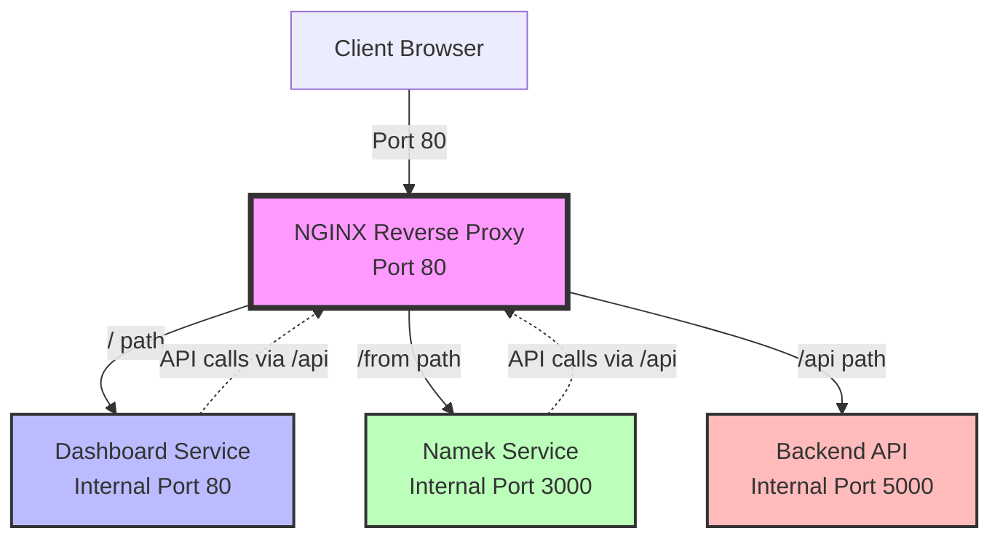

# NGINX Reverse Proxy Architecture Plan

## Overview
This plan outlines the setup of a main nginx reverse proxy on port 80 that routes traffic to different services based on URL paths.

## Architecture Diagram



## Routing Configuration

| Path Pattern | Target Service | Internal Port | Description |
|-------------|----------------|---------------|-------------|
| `/` | Dashboard | 80 | Main dashboard SPA |
| `/from/*` | Namek | 3000 | Hackathon submission app |
| `/api/*` | Backend | 5000 | ASP.NET Core API |

## Implementation Steps

### 1. Main NGINX Reverse Proxy Configuration

**File: `nginx/nginx.conf`**

Key features:
- Listen on port 80
- Route `/` to dashboard service
- Route `/from` to namek service with URL rewriting
- Route `/api` to backend service with URL rewriting
- Handle WebSocket connections if needed
- Proper proxy headers for client IP preservation
- Static asset caching
- Gzip compression

### 2. NGINX Dockerfile

**File: `nginx/Dockerfile`**

Simple nginx container with custom configuration.

### 3. Docker Compose Updates

**Changes to `docker-compose.prod.yml`:**

- Add nginx reverse proxy service
- Remove external port mappings from backend, namek, and dashboard
- Only expose port 80 through nginx
- Ensure proper network configuration
- Add health checks for nginx

**Before:**
```yaml
backend:
  ports:
    - "5000:5000"
namek:
  ports:
    - "3000:3000"
dashboard:
  ports:
    - "8080:80"
```

**After:**
```yaml
nginx:
  ports:
    - "80:80"
backend:
  expose:
    - "5000"
namek:
  expose:
    - "3000"
dashboard:
  expose:
    - "80"
```

### 4. Namek Configuration Updates

**File: `namek/vite.config.ts`**

Change base path from `/` to `/from`:
```typescript
base: '/from',
```

**File: `namek/build/server.js`**

Ensure the production server handles the `/from` base path correctly.

### 5. Frontend API Configuration

Both Dashboard and Namek need to call the backend through the nginx proxy at `/api` instead of direct URLs.

**Dashboard API calls:**
- Update API base URL to `/api`

**Namek API calls:**
- Update API_GATEWAY_URL to use `/api`

### 6. Static Asset Handling

The nginx configuration must handle:
- SPA routing (try_files fallback to index.html)
- Static assets with proper cache headers
- Correct path rewriting for namek's `/from` prefix
- CORS headers if needed

## Configuration Details

### NGINX Proxy Headers

```nginx
proxy_set_header Host $host;
proxy_set_header X-Real-IP $remote_addr;
proxy_set_header X-Forwarded-For $proxy_add_x_forwarded_for;
proxy_set_header X-Forwarded-Proto $scheme;
```

### URL Rewriting for Namek

The `/from` prefix needs to be preserved when proxying to namek since the app is built with `base: '/from'`:

```nginx
location /from {
    proxy_pass http://namek:3000;
    # Preserve the /from prefix
}
```

### URL Rewriting for Backend API

The `/api` prefix should be removed when proxying to the backend:

```nginx
location /api/ {
    proxy_pass http://backend:5000/;
    # Removes /api prefix
}
```

### SPA Routing

Both Dashboard and Namek are SPAs and need proper routing:

```nginx
# Dashboard
location / {
    proxy_pass http://dashboard:80;
}

# Namek
location /from {
    proxy_pass http://namek:3000;
}
```

## Testing Plan

1. **Dashboard Access**
   - Navigate to `http://your-domain/`
   - Verify dashboard loads correctly
   - Test SPA routing (refresh on different routes)
   - Verify static assets load

2. **Namek Access**
   - Navigate to `http://your-domain/from`
   - Verify namek app loads correctly
   - Test SPA routing within namek
   - Verify static assets load with `/from` prefix

3. **Backend API Access**
   - Test API calls from dashboard
   - Test API calls from namek
   - Verify all endpoints work through `/api` prefix
   - Check CORS if frontend and backend are on same domain

4. **Health Checks**
   - Verify nginx health check
   - Verify backend health check via `/api/healthcheck`
   - Verify namek health check via `/from/healthcheck`

## Potential Issues and Solutions

### Issue 1: Namek Static Assets 404

**Problem:** Static assets fail to load because they're referenced with `/assets/` instead of `/from/assets/`

**Solution:** Vite's `base: '/from'` should handle this automatically in the build

### Issue 2: API Calls Failing

**Problem:** Frontend apps still calling old API URLs

**Solution:** Update environment variables and API configuration in both apps

### Issue 3: CORS Errors

**Problem:** CORS errors when frontend calls backend

**Solution:** Since all traffic goes through nginx on same domain, CORS shouldn't be an issue, but backend may need to accept requests from proxy

### Issue 4: WebSocket Connections

**Problem:** WebSocket connections failing through proxy

**Solution:** Add WebSocket upgrade headers in nginx config:
```nginx
proxy_http_version 1.1;
proxy_set_header Upgrade $http_upgrade;
proxy_set_header Connection "upgrade";
```

## Security Considerations

1. **Remove Direct Access:** Ensure backend, namek, and dashboard are not accessible directly from outside the Docker network
2. **Rate Limiting:** Consider adding rate limiting to nginx
3. **SSL/TLS:** In production, add SSL certificate and redirect HTTP to HTTPS
4. **Access Logs:** Enable nginx access logs for monitoring
5. **Error Pages:** Configure custom error pages

## Rollback Plan

If issues occur:
1. Keep the old `docker-compose.prod.yml` as `docker-compose.prod.yml.backup`
2. Can quickly switch back by exposing original ports
3. Update DNS/load balancer if using external routing

## Next Steps

After reviewing this plan:
1. Approve the architecture
2. Switch to Code mode to implement the configuration
3. Test on staging environment
4. Deploy to production